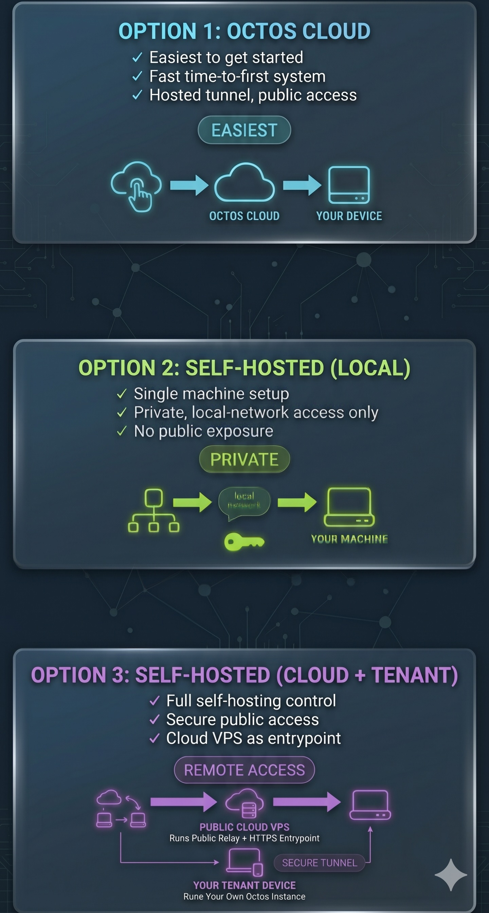
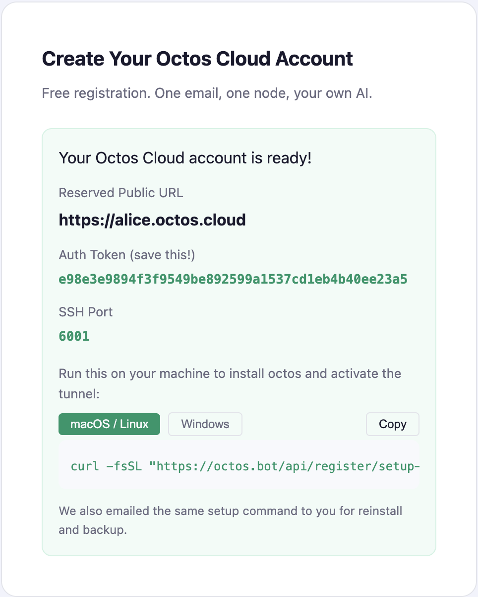

# Octos 🐙

> Like an octopus — 9 brains (1 central + 8 in each arm), every arm thinks independently, but they share one brain.

**Open Cognitive Tasks Orchestration System** — a Rust-native, API-first Agentic OS.

31MB static binary. 91 REST endpoints. 15 LLM providers. 14 messaging channels. Multi-tenant. Zero dependencies.

## What is Octos?

Octos is an open-source AI agent platform that lets you run your own AI system on a single machine or across a cloud-and-device pair. You deploy one Rust binary, connect your LLM provider and channels, and Octos handles routing, sessions, tools, memory, and multi-user isolation through a web dashboard and REST API.

You can think of it as the **backend operating system for AI agents**. Instead of building a new chatbot stack for every use case, you configure Octos profiles with their own prompts, models, tools, and channels, then manage them from one control plane.

The important part for new users is that Octos can be used in three distinct ways:

1. **Octos Cloud signup** — the easiest path; create an account, choose a node name, and run the generated setup command on your device.
2. **Self-hosted local** — run Octos only on your own machine or local network.
3. **Self-hosted cloud + tenant pair** — run your own public VPS plus your own tenant device for internet-accessible remote use.

## Why Octos

Most agentic systems are single-tenant chat assistants — one user, one model, one conversation at a time. Octos is different:

- **API-first Agentic OS**: 91 REST endpoints (chat, sessions, admin, profiles, skills, metrics, webhooks). Any frontend — web, mobile, CLI, CI/CD — can be built on top.
- **Multi-tenant by design**: One 31MB binary serves 200+ profiles on a 16GB machine. Each profile is a separate OS process with isolated memory, sessions, and data. Family Plan sub-accounts.
- **Multi-LLM DOT pipelines**: Define workflows as DOT graphs. Per-node model selection. Dynamic parallel fan-out spawns N concurrent workers at runtime.
- **3-layer provider failover**: RetryProvider → ProviderChain → AdaptiveRouter. Hedge racing, Lane scoring, circuit breakers.
- **LRU tool deferral**: 15 active tools for fast LLM reasoning, 34+ on demand. Idle tools auto-evict. `spawn_only` tools auto-redirect to background execution.
- **5 queue modes per session**: Followup, Collect, Steer, Interrupt, Speculative — users control agent concurrency via `/queue`.
- **Session control in any channel**: `/new`, `/s <name>`, `/sessions`, `/back` — works in Telegram, Discord, Slack, WhatsApp.
- **3-layer memory**: Long-term (entity bank, auto-injected), episodic (task outcomes in redb), session (JSONL + LLM compaction).
- **Native office suite**: PPTX/DOCX/XLSX via pure Rust (zip + quick-xml).
- **Sandbox isolation**: bwrap + sandbox-exec + Docker. `deny(unsafe_code)` workspace-wide. 67 prompt injection tests.

## Choose a setup path

All three paths are valid. The easiest is Octos Cloud signup, but the self-hosted modes are first-class as well.

| Option | Machines involved | Public internet access | Who manages the infrastructure | Best fit |
| --- | --- | --- | --- | --- |
| **1. Octos Cloud signup** | Your device + Octos Cloud | Yes | Octos Cloud + you | Fastest path |
| **2. Self-hosted local-only** | One machine | No | You | Local/private use |
| **3. Self-hosted cloud + tenant pair** | Your VPS + your device | Yes | You | Full self-hosting with remote access |

Visual overview:



### Option 1: Sign up on Octos Cloud

This is the easiest way to get started.

1. Go to the Octos Cloud signup page.
2. Register with your email.
3. Choose a custom node name.
4. Run the generated setup command on your device.

That setup command is personalized for your machine and includes the values needed to connect your device to the Octos cloud relay. After setup, your Octos instance is accessible on the public internet under your node name.

When you click `Send Code` on the portal, check your Spam folder if the email does not arrive right away. It is also a good idea to add the Octos sending domain/address to your address book so future login and setup emails are delivered reliably.

After signup, the portal shows your node details, public URL, and the setup command to run on your device:



This path is the best choice if you want:

- the fastest time to first working system
- public access without running your own VPS
- a hosted signup and tunnel flow

### Option 2: Self-hosted local-only

Choose this if you want Octos on your own machine with no public exposure. Your dashboard is available only on the machine itself or your local network.

```bash
# macOS / Linux
curl -fsSL https://github.com/octos-org/octos/releases/latest/download/install.sh | bash
```

```powershell
# Windows (PowerShell)
irm https://github.com/octos-org/octos/releases/latest/download/install.ps1 | iex
```

This installs the binary, sets up `octos serve` as a service, and starts the local dashboard at `http://localhost:8080/admin/`.

Supported platforms: **macOS ARM64**, **Linux x86_64**, **Linux ARM64**, and **Windows x64**.

Choose this path if you want:

- the simplest self-hosted setup
- one machine only
- local-network access only
- the option to upgrade later to tenant mode

### Option 3: Self-hosted cloud + tenant pair

Choose this if you want full self-hosting but still want your own device accessible from anywhere on the public internet.

This mode uses two machines:

- a **cloud VPS** that runs the public relay and HTTPS entrypoint
- your **tenant device** that runs your own Octos instance

The tenant device connects outbound to the VPS using `frpc`. The VPS runs the public components, including TLS and routing. This gives you ngrok-style public access, but through your own infrastructure.

For production use, the VPS also needs wildcard HTTPS. The current setup uses Caddy plus Cloudflare DNS challenge, or another supported DNS provider, to issue and manage certificates for the main domain and tenant subdomains.

#### 1. Bootstrap the VPS

On a Linux VPS with DNS already pointed at it:

```bash
git clone https://github.com/octos-org/octos.git
cd octos
bash scripts/cloud-host-deploy.sh \
    --domain octos.example.com \
    --https --dns-provider cloudflare
```

This wraps three host-side steps:

- `scripts/install.sh` — installs `octos serve` and sets `mode = "cloud"`
- `scripts/frp/setup-frps.sh` — installs and configures `frps`
- `scripts/frp/setup-caddy.sh` — configures public routing and wildcard HTTPS

Recommended DNS split:

- `octos.example.com` and `*.octos.example.com` for the portal and tenant dashboards
- `frps.octos.example.com` as `DNS only` so tenant machines can reach the FRP control port

#### 2. Register or create a tenant

Once the VPS is up, the cloud host can issue a personalized tenant setup command. That command includes the tenant name, per-tenant tunnel token, SSH port, dashboard auth token, domain, and relay address. The user receives this command directly in the portal and also by email.

#### 3. Run the tenant setup command on your own device

Use the exact command provided in step 2. The example below is reference only, to show what kind of command the portal issues:

```bash
curl -fsSL https://github.com/octos-org/octos/releases/latest/download/install.sh | bash -s -- \
    --tunnel \
    --tenant-name alice \
    --frps-token <per-tenant-uuid> \
    --ssh-port 6001 \
    --domain octos.example.com \
    --frps-server frps.octos.example.com \
    --auth-token <dashboard-token>
```

The installer writes the tenant tunnel configuration, installs `frpc`, and starts the public tunnel alongside `octos serve`.

### Can I start local and upgrade later?

Yes.

A local-only self-hosted machine can be upgraded later to tenant mode once you have a cloud host available. The saved installers support this directly:

```bash
# macOS / Linux
~/.octos/bin/install.sh --tunnel
~/.octos/bin/install.sh --doctor
```

```powershell
# Windows
& "$HOME\.octos\bin\install.ps1" -Tunnel
& "$HOME\.octos\bin\install.ps1" -Doctor
```

That upgrade path is intentional: start with one machine, then add a VPS only when you need internet-facing access.

### Optional self-hosted features

```bash
# Auto-install runtime dependencies (git, node, python, ffmpeg, chromium)
curl ... | bash -s -- --install-deps

# Set up Caddy reverse proxy with HTTPS for self-hosted local deployments
curl ... | bash -s -- --caddy-domain crew.example.com
```

### Uninstall

Use the matching uninstall flag on the machine you want to remove:

```bash
# Tenant or local machine (macOS / Linux)
~/.octos/bin/install.sh --uninstall

# Tenant or local machine (Windows PowerShell)
& "$HOME\.octos\bin\install.ps1" -Uninstall

# Cloud VPS — removes octos serve, frps, and Caddy
bash scripts/cloud-host-deploy.sh --uninstall

# Cloud VPS + wipe data directory (~/.octos) as well
bash scripts/cloud-host-deploy.sh --uninstall --purge
```

### Runtime deployment modes

Octos uses `"mode"` in `~/.octos/config.json` to describe how a running node behaves:

- **`local`** — standalone machine
- **`tenant`** — end-user machine with an optional public tunnel
- **`cloud`** — VPS relay with tenant management and public signup

`scripts/install.sh` and `scripts/install.ps1` create local or tenant configs. `scripts/cloud-host-deploy.sh` creates or updates cloud-host configs with `mode = "cloud"` plus `tunnel_domain` and `frps_server`.

## Build from source

For development against an unreleased checkout:

```bash
# Build and install
cargo install --path crates/octos-cli

# Initialize workspace
octos init

# Set API key (any supported provider — auto-detected during install)
export OPENAI_API_KEY=your-key-here    # or ANTHROPIC_API_KEY, GEMINI_API_KEY, etc.

# Interactive chat
octos chat

# Multi-channel gateway
octos gateway

# Web dashboard + REST API
octos serve
```

For a repo-local tenant deploy (builds from source, sets up the same service + tunnel as `install.sh`), use `scripts/local-tenant-deploy.sh --full`.

## Documentation

📖 **[Full Documentation](https://octos-org.github.io/octos/)** — installation, configuration, channels, providers, memory, skills, advanced features, and more.

**Quick links:**
- [Installation & Deployment](https://octos-org.github.io/octos/installation.html)
- [Configuration](https://octos-org.github.io/octos/configuration.html)
- [LLM Providers & Routing](https://octos-org.github.io/octos/providers.html)
- [Gateway & Channels](https://octos-org.github.io/octos/channels.html)
- [Memory & Skills](https://octos-org.github.io/octos/memory-skills.html)
- [Advanced Features](https://octos-org.github.io/octos/advanced.html) (queue modes, hooks, sandbox, tools)
- [CLI Reference](https://octos-org.github.io/octos/cli-reference.html)
- [Skill Development](https://octos-org.github.io/octos/skill-development.html)

**中文:** [中文 README](README-zh.md) | [用户指南](https://octos-org.github.io/octos/zh/) (doc site)

## Architecture

```
octos serve (control plane + dashboard)
  ├── Profile A → gateway process (Telegram, WhatsApp)
  ├── Profile B → gateway process (Feishu, Slack)
  └── Profile C → gateway process (CLI)
       │
       ├── LLM Provider (Anthropic, OpenAI, Gemini, DeepSeek, ...)
       │   └── AdaptiveRouter → ProviderChain → RetryProvider
       ├── Tool Registry (25 built-in + plugins + 9 app-skills)
       │   └── LRU Deferral (15 active, activate on demand)
       ├── Pipeline Engine (DOT graphs, per-node model, parallel fan-out)
       ├── Session Store (JSONL, LRU cache, LLM compaction)
       ├── Memory (MEMORY.md + entity bank + episodes.redb + HNSW)
       └── Skills (bundled + installable from octos-hub)
```

## License

See [LICENSE](LICENSE).
