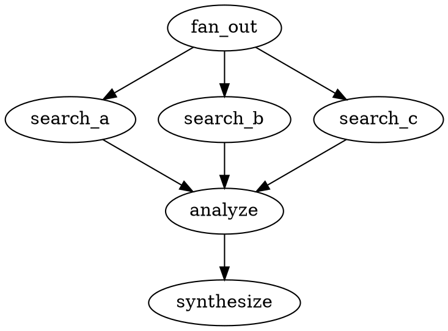

# Parallel Pipeline Execution

crew-pipeline supports parallel fan-out/fan-in via the `parallel` handler kind.

## Problem

The default executor walks the graph sequentially — one node at a time. For workflows like multi-angle research, this means 4 search agents run one after another (~4x slower than needed).

## Solution: `handler="parallel"` + `converge="node_id"`

A `parallel` node runs **all its outgoing targets concurrently** using `futures::join_all`, merges their outputs, and jumps to the convergence node.

```
                    ┌─ search_direct  ──┐
                    ├─ search_english ──┤
fan_out ───────────┤                    ├──→ analyze ──→ synthesize
  (parallel)        ├─ search_compare ──┤
                    └─ search_trends  ──┘

                    All run via join_all.
                    Wall time = max(targets), not sum(targets).
```

## DOT Syntax



### Attributes

| Attribute | Required | Description |
|-----------|:--------:|-------------|
| `handler="parallel"` | Yes | Marks the node as a fan-out point |
| `converge="node_id"` | Yes | The node to resume at after all targets complete |

The `converge` node receives the **merged output** of all parallel targets as its input.

## Execution Flow

1. Executor reaches the `parallel` node
2. Collects all outgoing edges → target node IDs
3. Spawns all targets concurrently via `futures::future::join_all`
4. Each target runs its handler (Codergen, Shell, etc.) independently
5. `join_all` blocks until **all** targets complete
6. Outputs are merged: `## Label A\n\n{output_a}\n\n---\n\n## Label B\n\n{output_b}\n\n...`
7. All targets marked as "already executed" (skipped if traversed later)
8. Executor jumps to `converge` node with merged text as input
9. Normal sequential execution resumes from there

## Input Distribution

All parallel targets receive the **same input** — the output of the node preceding the parallel fan-out (or user input if the fan-out is the start node).

To give each target different input, use template variables in the prompt:

```dot
search_a [prompt="Search for {topic} in Chinese"]
search_b [prompt="Search for {topic} in English"]
search_c [prompt="Search for {topic} benchmarks"]
```

Each target's prompt is different, but the task input (what the agent works on) is the same.

## Output Merging

Target outputs are concatenated with headers and separators:

```markdown
## Deep Search (Chinese)

{output from search_a}

---

## Deep Search (English)

{output from search_b}

---

## Benchmarks

{output from search_c}
```

The header uses the node's `label` attribute (falls back to node ID).

## Error Handling

- If **any** target returns `OutcomeStatus::Error`, the parallel node's overall status is `Fail`
- But execution **continues** — the convergence node still receives all outputs (including error messages)
- Individual target errors are included in the merged output as `Error: {message}`
- If you want the pipeline to stop on any error, add a `gate` after the convergence:

```dot
fan_out [handler="parallel", converge="check"]
// ... targets ...
check [handler="gate", prompt="outcome.status == \"pass\""]
check -> analyze [condition="outcome.status == \"pass\""]
```

## Retries

Each parallel target respects its own `max_retries` attribute:

```dot
search_a [prompt="...", max_retries="2"]  // retries up to 2 times on error
search_b [prompt="...", max_retries="0"]  // no retries (default)
```

Retries use exponential backoff: 1s, 2s, 4s, 8s, ...

## Validation Rules

Rule 13 checks parallel nodes:

| Check | Severity | Message |
|-------|----------|---------|
| `converge` attribute missing | Error | `parallel node 'X' missing converge attribute` |
| `converge` target doesn't exist | Error | `parallel node 'X' converge target 'Y' does not exist` |
| No outgoing edges | Warning | `parallel node 'X' has no outgoing edges` |

## Limitations

- **No nested parallelism** — a parallel target cannot itself be a `parallel` node (it will work but all nested targets run sequentially within that target's handler)
- **No partial results** — `join_all` waits for ALL targets; if one is slow, everything waits
- **Same input to all targets** — no built-in way to split/partition input across targets
- **Text-only merging** — outputs are concatenated as text, no structured data passing
- **No timeout on the fan-out** — individual targets have `timeout_secs`, but the parallel group as a whole has no aggregate timeout

## Performance

For a research pipeline with 4 search agents (each ~300s):

```
Sequential:  300s + 300s + 300s + 300s = ~1200s
Parallel:    max(300s, 300s, 300s, 300s) = ~300s  (4x speedup)
```

The speedup equals the number of targets, bounded by the slowest target.

## Example: Deep Research Pipeline

See `mofa-skills/mofa-research/deep_research.dot` for a complete parallel research pipeline.
