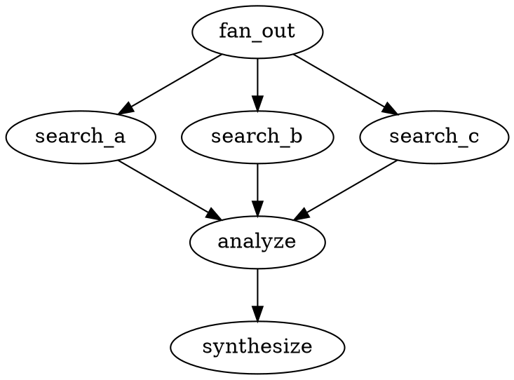
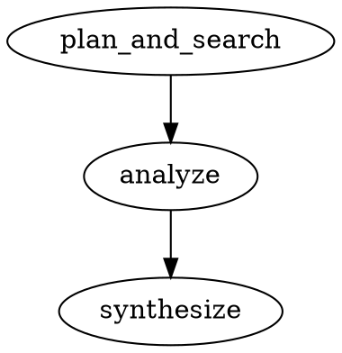

# Parallel Pipeline Execution

crew-pipeline supports parallel fan-out/fan-in via the `parallel` handler kind.

## Problem

The default executor walks the graph sequentially — one node at a time. For workflows like multi-angle research, this means 4 search agents run one after another (~4x slower than needed).

## Solution: `handler="parallel"` + `converge="node_id"`

A `parallel` node runs **all its outgoing targets concurrently** using `futures::join_all`, merges their outputs, and jumps to the convergence node.

```
                    ┌─ search_direct  ──┐
                    ├─ search_english ──┤
fan_out ───────────┤                    ├──→ analyze ──→ synthesize
  (parallel)        ├─ search_compare ──┤
                    └─ search_trends  ──┘

                    All run via join_all.
                    Wall time = max(targets), not sum(targets).
```

## DOT Syntax



### Attributes

| Attribute | Required | Description |
|-----------|:--------:|-------------|
| `handler="parallel"` | Yes | Marks the node as a fan-out point |
| `converge="node_id"` | Yes | The node to resume at after all targets complete |

The `converge` node receives the **merged output** of all parallel targets as its input.

## Execution Flow

1. Executor reaches the `parallel` node
2. Collects all outgoing edges → target node IDs
3. Spawns all targets concurrently via `futures::future::join_all`
4. Each target runs its handler (Codergen, Shell, etc.) independently
5. `join_all` blocks until **all** targets complete
6. Outputs are merged: `## Label A\n\n{output_a}\n\n---\n\n## Label B\n\n{output_b}\n\n...`
7. All targets marked as "already executed" (skipped if traversed later)
8. Executor jumps to `converge` node with merged text as input
9. Normal sequential execution resumes from there

## Input Distribution

All parallel targets receive the **same input** — the output of the node preceding the parallel fan-out (or user input if the fan-out is the start node).

To give each target different input, use template variables in the prompt:

```dot
search_a [prompt="Search for {topic} in Chinese"]
search_b [prompt="Search for {topic} in English"]
search_c [prompt="Search for {topic} benchmarks"]
```

Each target's prompt is different, but the task input (what the agent works on) is the same.

## Output Merging

Target outputs are concatenated with headers and separators:

```markdown
## Deep Search (Chinese)

{output from search_a}

---

## Deep Search (English)

{output from search_b}

---

## Benchmarks

{output from search_c}
```

The header uses the node's `label` attribute (falls back to node ID).

## Error Handling

- If **any** target returns `OutcomeStatus::Error`, the parallel node's overall status is `Fail`
- But execution **continues** — the convergence node still receives all outputs (including error messages)
- Individual target errors are included in the merged output as `Error: {message}`
- If you want the pipeline to stop on any error, add a `gate` after the convergence:

```dot
fan_out [handler="parallel", converge="check"]
// ... targets ...
check [handler="gate", prompt="outcome.status == \"pass\""]
check -> analyze [condition="outcome.status == \"pass\""]
```

## Retries

Each parallel target respects its own `max_retries` attribute:

```dot
search_a [prompt="...", max_retries="2"]  // retries up to 2 times on error
search_b [prompt="...", max_retries="0"]  // no retries (default)
```

Retries use exponential backoff: 1s, 2s, 4s, 8s, ...

## Validation Rules

Rule 13 checks parallel nodes:

| Check | Severity | Message |
|-------|----------|---------|
| `converge` attribute missing | Error | `parallel node 'X' missing converge attribute` |
| `converge` target doesn't exist | Error | `parallel node 'X' converge target 'Y' does not exist` |
| No outgoing edges | Warning | `parallel node 'X' has no outgoing edges` |

## Limitations

- **No nested parallelism** — a parallel target cannot itself be a `parallel` node (it will work but all nested targets run sequentially within that target's handler)
- **No partial results** — `join_all` waits for ALL targets; if one is slow, everything waits
- **Same input to all targets** — no built-in way to split/partition input across targets
- **Text-only merging** — outputs are concatenated as text, no structured data passing
- **No timeout on the fan-out** — individual targets have `timeout_secs`, but the parallel group as a whole has no aggregate timeout

## Performance

For a research pipeline with 4 search agents (each ~300s):

```
Sequential:  300s + 300s + 300s + 300s = ~1200s
Parallel:    max(300s, 300s, 300s, 300s) = ~300s  (4x speedup)
```

The speedup equals the number of targets, bounded by the slowest target.

## Dynamic Parallel (`handler="dynamic_parallel"`)

Unlike `parallel` where targets are defined statically in the DOT graph, `dynamic_parallel` lets the LLM **plan sub-tasks at runtime**. The node uses a two-phase approach: first an LLM planner generates a list of tasks, then each task is executed concurrently as a synthetic worker node.

### How It Works

1. Executor reaches a `dynamic_parallel` node
2. **Planning phase**: The node's `prompt` (or a default planning prompt) is sent to an LLM along with the current input. The LLM responds with a JSON array of `{"task": "...", "label": "..."}` objects
3. The response is parsed into `DynamicTask` structs. If parsing fails or returns fewer than 2 tasks, a set of 3 fallback tasks is used instead
4. **Worker phase**: For each planned task, a synthetic `PipelineNode` is created with `handler=codergen`. The `worker_prompt` template has `{task}` replaced with each task's description
5. All synthetic nodes are executed concurrently via `futures::future::join_all`
6. Outputs are merged (same format as `parallel`) and fed to the `converge` node

### DOT Syntax



### Attributes

| Attribute | Required | Default | Description |
|-----------|:--------:|---------|-------------|
| `handler="dynamic_parallel"` | Yes | — | Marks the node as a dynamic fan-out point |
| `converge="node_id"` | Yes | — | The node to resume at after all workers complete |
| `prompt` | No | Built-in planning prompt | Prompt for the planning LLM call |
| `worker_prompt` | No | Built-in research prompt | Template for each worker; `{task}` is replaced with the planned task description |
| `planner_model` | No | Node's `model` or `default_model` | Model key for the planning LLM call |
| `max_tasks` | No | 8 | Maximum number of dynamic tasks (planner output is truncated to this) |
| `tools` | No | All builtins | Allowed tools for worker nodes |

### Fallback Behavior

If the planner LLM fails or returns fewer than 2 tasks, the executor falls back to 3 hardcoded tasks:

1. `"Search for: {input}"` (Primary search)
2. `"Search in English for: {input}"` (English search)
3. `"Search for recent trends and developments: {input}"` (Trends)

This ensures the pipeline always makes progress even if the planning call fails.

### Differences from Static `parallel`

| Aspect | `parallel` | `dynamic_parallel` |
|--------|-----------|-------------------|
| Targets | Defined in DOT graph as explicit nodes | Generated at runtime by LLM planner |
| Number of workers | Fixed (number of outgoing edges) | Variable (2 to `max_tasks`) |
| Worker prompts | Each node has its own prompt | All workers share `worker_prompt` template |
| Extra LLM call | None | One planning call before workers |
| Fallback | None needed | 3 default tasks on planner failure |

## Example: Deep Research Pipeline

See `mofa-skills/mofa-research/deep_research.dot` for a complete parallel research pipeline.
